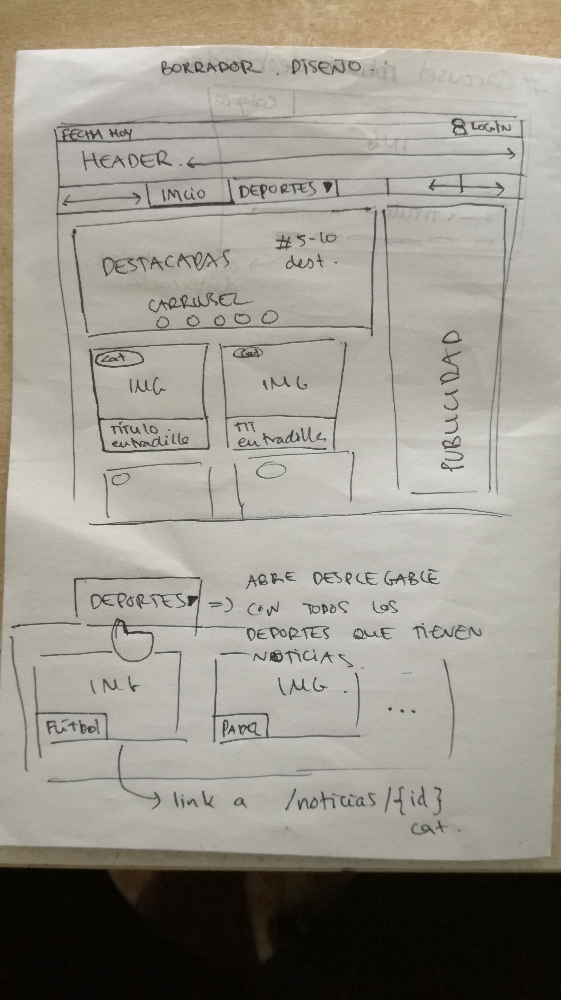

# Proyecto Noticias deportivas

> host github: https://adriangalende.github.io/Lenguaje-de-Marcas/noticias-deportivas/

---
El objetivo de este proyecto es poder realizar una página de noticias, que vaya modificando el contenido conforme vamos bajando el scroll:

Es decir, tenemos que realizar una página principal donde vayan saliendo noticias las actuales arriba y que vayan mostrándose anteriores cada vez que vayamos bajando el scroll.

## Requisitos:

* HTML5
* CSS 
* Bootstrap
* JQuery
* Uso de Sprites
* Uso iconos fuentes externas
* Carga de ficheros JSON

---
## Objetivo Básico:
> Proceso
> - [ ] pendiente 
> - [x] hecho 

- [x] Fichero JSON con noticias
    - [x] json destacadas
    - [x] json noticias normales 
- [x] Leer Fichjero JSON y Obtener noticias
    - [x] Muestra 3 noticias destacadas 
    - [x] Mostrar 3 noticias ordenadas por id ( la última id es la noticia actual)
   
- [x] Estructura de la página
    - [x] Diseño en papel
    - [x] Bootstrap 
    - [x] Banner publicidad a la derecha
        - [x] Vertical desaparece cuando la pantalla es tamaño tablet o móvil
        - [x] Horizontal aparece cuando desaparece el vertical y viceversa
    - [x] Al clicar en cualquier noticia, esta se abre en una nueva página de forma dinámica  
        - [x] La noticia muestra una imagen, el título, la entradilla, el texto y botones de share
        - [x] Si la noticia tiene video, lo muestra
    - [x] Menu / Categorias --> Carga categorias disponibles ( si existe alguna noticia con esta categoria )
    - [x] resources/rss.xml --> Creado documento rss
    - [x] Opengraph: Genera automáticamente las etiquetas opengraph
        - [ ] problema: Al hacer share para facebook no coge los datos bien    
        

- [x] Sistema recarga con scroll
    - [x] Mostrar N noticias
    - [x] Mostrar siguientes noticias bajando scroll
    
- [x] Sistema recarga con botón    
    

Diseño en papel del proyecto

Desde el principio tuve clarísimo cual iba a ser el diseño de la página y alguna de sus funcionalidades    

 

> Una vez finalizados los objetivos básicos vamos a intentar ir un poco más allá

 ## Objetivo pro:

 Conseguir obtener las noticias dinámicamente de otra página web en lugar de escribirlas a mano
 
 ** Esta parte de la práctica la he realizado en el proyecto de Base de datos

---
